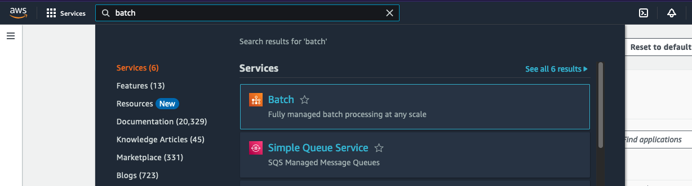
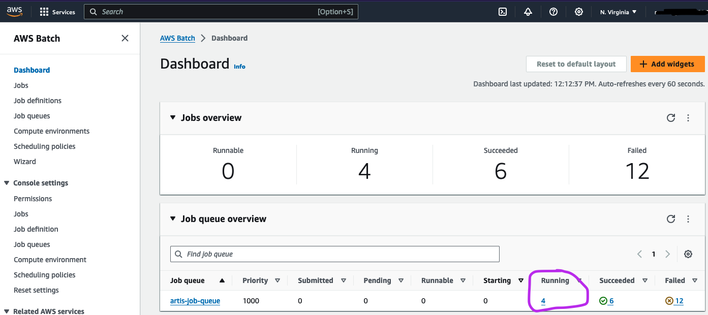
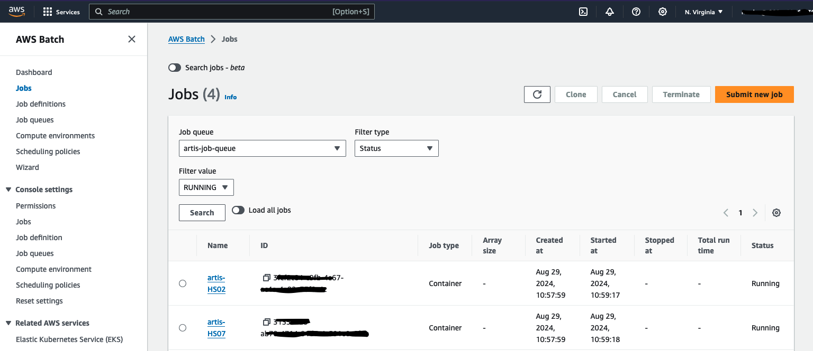
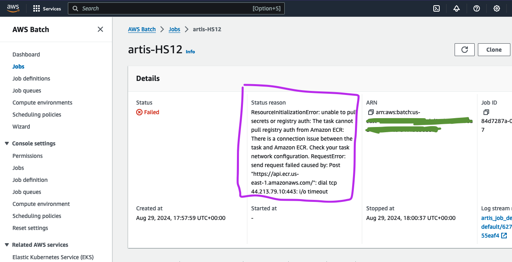

# ARTIS HPC

This repository automates and orchestrates running the ARTIS model pipeline [`artis-model`](https://github.com/Seafood-Globalization-Lab/artis-model) on AWS Batch. It supports two primary workflows:

1. **Full (brand-new) setup**  
   - provision AWS infrastructure
   - build and push Docker image to AWS ECR
   - upload model inputs and code to AWS S3
   - submit jobs (by HS version) to AWS Batch

2. **Restart model after country solutions**  
   - Option to re-use existing AWS resources and Docker image
   - Option to skip upload updated model inputs
   - Submit Batch jobs to start at `get_snet()` using modified `02-artis-pipeline-restart-snet-hs[yy].R`

**Primary Audience**  
A technically proficient person (running macOS) who maintains, develops, and runs the ARTIS mdoel. 

**What This Repo Does Not Do:**

- It does not run other ARTIS model scripts for raw data input (`01-clean-model-inputs.R`, `03-combine-tables.R`, or `04-create-metadata.R`).
- This is not the place to make changes to the ARTIS model code. 
- This is not the place to find ARTIS model version releases or DOIs. 
- This is probably not helpful or important for people interested in the data. 

## Table of Contents

- [Overview](#overview)
- [`artis-model` Version Compatibility](#artis-model-version-compatibility)
- [Prerequisites](#prerequisites)
  - [Software Installations](#software-installations)
  - [Local Repositories](#local-repositories)
  - [AWS Credentials & IAM Access](#aws-credentials--iam-access)
- [Run ARTIS on AWS Instructions](#run-artis-on-aws-instructions)
  - [Full Setup Instructions](#full-setup-instructions)
  - [Run ARTIS on AWS Instructions from `get_snet()` ("Restart")](#run-artis-on-aws-instructions-from-get_snet-restart)
- [Installations](#installations)
  - [Homebrew Installation](#homebrew-installation)
  - [Docker Desktop Installation](#docker-desktop-installation)
  - [AWS CLI Installation](#aws-cli-installation)
  - [Terraform CLI Installation](#terraform-cli-installation)
  - [Python Installation](#python-installation)
- [S3 Bucket & Output Structure](#s3-bucket--output-structure)
- [Checks & Troubleshooting](#checks--troubleshooting)
  - [Status of jobs submitted to AWS Batch](#status-of-jobs-submitted-to-aws-batch)
  - [Troubleshoot failed jobs](#troubleshoot-failed-jobs)
  - [Check CloudWatch logs for a specific job](#check-cloudwatch-logs-for-a-specific-job)
  - [Check for all expected outputs in S3 bucket](#check-for-all-expected-outputs-in-s3-bucket)

## Overview

This repository [`artis-hpc`](https://github.com/Seafood-Globalization-Lab/artis-hpc) contains scripts to move ARTIS code, configure AWS credentials, and set up AWS to run the model by each HS versions (including all associated years for each HS version). It functions as a wrapper to run the ARTIS package pipeline [`artis-model`](https://github.com/Seafood-Globalization-Lab/artis-model) `./02-artis-pipeline.R`.

- The **ARTIS R package** [`Seafood-Globalization-Lab/artis-model`](https://github.com/Seafood-Globalization-Lab/artis-model) contains all model functions and pipeline scripts that run inside of the `artis-image` docker image on AWS.
- This **ARTIS HPC** [`Seafood-Globalization-Lab/artis-hpc`](https://github.com/Seafood-Globalization-Lab/artis-hpc) repo sets up the compute tools, environments and resources:  
  - Provision AWS EC2/S3/VPC/Batch via Terraform  
  - Build a Docker image (`artis-image`) containing software installations and necessary R and python packages
  - Push Docker image to ECR. 
  - Push code and data inputs to S3.  
  - Submit AWS Batch jobs for each HS version.  
  - Download results to local machine repo directory
  - (Optional) Resume a failed `get_snet()` step without re-solving the mass-balance.

## `artis-model` Version Compatibility

**Required ARTIS Model Version:** [`Seafood-Globalization-Lab/artis-model@v1.1.0`](https://github.com/Seafood-Globalization-Lab/artis-model/releases/tag/v1.1.0) 

Ensure your local `artis-model` repo is up to date with the remote repo and on the appropriate branch that you want to run the model from. Following the ARTIS software development workflow, this is likely `artis-model/development`.

## Prerequisites

Setup requirements before running any `artis-hpc` scripts. Developed and tested for macOS (arm64 and x86 architecture). 

### Software Installations

Jump to [Intall instructions](#installations) 

- AWS CLI (v2)
- Terraform CLI
- Python 3.11+
- Docker Desktop 

### Local Repositories 

- Local copy of [`Seafood-Globalization-Lab/artis-hpc`](https://github.com/Seafood-Globalization-Lab/artis-hpc) repo on the correct branch.
- Local copy of [`Seafood-Globalization-Lab/artis-model`](https://github.com/Seafood-Globalization-Lab/artis-model) repo so that the `artis-hpc/setup_artis_hpc.sh` script can copy relevant model code, scripts, and input data into your local `artis-hpc` repo.

### AWS Credentials & IAM Access

- IAM name and password
- AWS access key
- AWS secret access key

> [!NOTE]  
> Create IAM resources as needed (One‐time) with these instructions [artis-hpc/docs/iam-setup.md](docs/iam-setup.md)
- Ensure you have an IAM user in an Admin group with `AdministratorAccess`. 

## Run ARTIS on AWS Instructions

### Full Setup Instructions

#### Set your AWS credentials

- Set as environment variables in **shell/terminal** (replace brackets with your values, do not include brackets):  

   ```zsh
   export AWS_ACCESS_KEY=[YOUR_AWS_ACCESS_KEY]
   ```
   ```zsh
   export AWS_SECRET_ACCESS_KEY=[YOUR_AWS_SECRET_ACCESS_KEY]
   ```
   ```zsh
   export AWS_REGION=us-east-1
   ```
   ```zsh
   #example check value
   echo $AWS_ACCESS_KEY
   ```

#### Set AWS configuration files 

- modify `~/.aws/credentials` and `~/.aws/config`

   ```zsh
   aws configure set aws_access_key_id $AWS_ACCESS_KEY
   ```
   ```zsh
   aws configure set aws_secret_access_key $AWS_SECRET_ACCESS_KEY
   ```
   ```zsh
   aws configure set region $AWS_REGION
   ```
   ```zsh
   #check value with 
   aws configure get aws_access_key_id
   ```

#### Configure `artis-hpc` repo

- Setup repo with several helper scripts encapsulated in `./setup_artis_hpc.sh`(differs for restarting ARTIS) - replace `< >` with your local repo path
   
   ```zsh
   bash setup_artis_hpc.sh </path/to/local/artis-model> </path/to/local/artis-hpc>
   ```

   `./setup_artis_hpc.sh` does the following:

   - Set `HS_VERSIONS` environmental variable, 
   - Create or clear `./data_s3_upload/` directory
   - Copy `artis-model/model_inputs/` into `artis-hpc` repo (excludes baci `*including_value.csv` files)
   - Copy `artis-model` R package structure, metadata, and scripts (`./R/, DESRIPTION, NAMESPACE, `00-aws-hpc-setup.R`, `02-artis-pipeline.R`)
   - Create HS version specific versions of `02-artis-pipeline.R` for AWS Batch Jobs
   - Detects and sets local machine architecture for Docker image build later
   - Creates Python Virtual Environment
   <details>
      <summary>Open to View Details </summary>
      **Setup local Python environment**  
      Create a standardized environment to run the python scripts in. Terminal working directory needs to be in `.../.../artis-hpc` directory. All of the following code is run in the terminal/command line (not the console):

         - confirm you are in the correct working directory
      ```zsh
      pwd 
      ```
         - create a virtual environment
      ```zsh
      python3 -m venv venv
      ```
         - open virtual environment
      ```zsh
      source venv/bin/activate
      ```
         - install all required python packages
      ```zsh
      pip3 install -r requirements.txt
      ```
         - check that all python requirements have been downloaded
      ```zsh
      pip3 list
      ```

         *If an error occurs follow these instructions:*

         - upgrade version of pip
      ```zsh
      pip install --upgrade pip
      ```
         - Install all required python modules again
      ```zsh
      pip3 install -r requirements.txt
      ```

         *If errors still occur:*

         - install each python package in the `requirements.txt` file individually
      ```zsh
      pip3 install [PACKAGE NAME]
      ```
   </details>
   - Ensures AWS credentials are set


   - Syncs `data_s3_upload/ARTIS_model_code/` and `data_s3_upload/model_inputs/` to your S3 bucket (e.g., `s3://artis-s3-bucket/`).

#### Launch Docker Desktop

- Open your local GUI Docker Desktop application

   Keep this running in the background while setting up ARTIS to run on AWS. Docker Desktop is the Docker engine used to build the Docker image locally and Authenticates with AWS ECR where the image is pushed to. 

#### Prepare and Launch ARTIS HPC on AWS

- Run -- build new Docker image -- keep system from sleeping :

   ```zsh 
   caffeinate -s python3 initial_setup.py \
   -chip arm64 \
   -aws_access_key $AWS_ACCESS_KEY \
   -aws_secret_key $AWS_SECRET_ACCESS_KEY \
   -s3 artis-s3-bucket \
   -ecr artis-image
   ```
   - `-chip` is `arm64` (M1/M2 Mac) or `x86` (Intel) based on the CPU architecture of your Mac machine (not developed or tested for non-Mac machines).  
   - `-s3` S3 bucket name. Leave `artis-s3-bucket` to prevent breaking things.  
   - `-ecr` is the ECR repository name `artis-image`. The Docker image is also `artis-image`. Leave this alone. 
   - **Optional:** add `-di artis-image:latest` to skip Docker build if you already have an image in ECR.
   - **Optional:** add `caffeinate` before calling python script. This is a mac native command. Docker image build can take a while.
      - `caffeinate -s` prevents the system from sleeping while the preceeding process (i.e. `python3 initial_setup.py`) is running.
      - `caffeinate -d -s` prevents the system and display from sleeping.

- OR Run -- use existing Docker image:

   ```zsh
   python3 initial_setup.py \
   -chip arm64 \
   -aws_access_key $AWS_ACCESS_KEY \
   -aws_secret_key $AWS_SECRET_ACCESS_KEY \
   -s3 artis-s3-bucket \
   -ecr artis-image \
   -di artis-image:latest
   ```

   **`initial_setup.py` Does:**
   - Copies the correct Dockerfile (ARM64 vs. X86) from to `./Dockerfile`.  
   - Injects AWS credentials into `./Dockerfile` and `.Renviron`.  
   - Updates Terraform files (`main.tf`, `variables.tf`) with S3/ECR names.  
   - Runs `terraform init`, `terraform fmt`, `terraform validate`, and `terraform apply -auto-approve` to create VPC, Subnets, Security Groups, IAM Roles, Batch Compute Environments, Job Queues, etc.  
   - Updates `s3_upload.py` and `s3_download.py` to use the new S3 bucket name
   - Updates `docker_image_create_and_upload.py` to use the new ECR repo name
   - Runs `s3_upload.py` to upload `./data_s3_upload/ARTIS_model_code/` and `./data_s3_upload/model_inputs/` to S3. 
   - Builds and pushes the `artis-image` Docker image with `./docker_image_create_and_upload.py` copy.  
   - Stops before submitting Batch jobs (proceed to next step).  

#### Submit ARTIS Batch Jobs

- Update environmental variable `HS_VERSIONS` to control which HS versions are run on AWS.

   Each HS version submitted in this call will boot up a separate instance of the Docker image `artis-image` to run the ARTIS pipeline for that particular HS version over all years included in that particular HS version. runs `02-artis-pipeline_hsXX.R` inside the container.

   Examples:

   ```zsh
   export HS_VERSIONS="96"
   ``` 

   ```zsh
   export HS_VERSIONS="96,02"
   ``` 

- Submit Jobs to AWS Batch for each specified HS version

   ```zsh
   python3 submit_artis_jobs.py
   ```

#### Monitor Progress

   - Check AWS Batch job statuses in the AWS console on your browser.  
   - Open specific job and look for "Log stream name" link/id. Open to see real time console output from the model run. 

#### Download Outputs 

   - Downloads outputs into local`artis-hpc/outputs_[RUN_DATE]/…`
   ```zsh
   python3 s3_download.py
   ```

   - Add `caffeinate` before call to keep process running (prevents system sleep)
   ```zsh
   caffeinate -s python3 s3_download.py
   ```  

#### Teardown all AWS resources  

   - Remove all AWS resources using terraform files written out at the root level of `artis-hpc/`. 

   ```zsh
   terraform destroy
   ```
   
   Manually remove these files when cleaning up directory. DO NOT COMMIT TO GIT - they include your personal AWS credentials. KEEP `./terraform_scipts/*` - these are templates without credentials.

   ```zsh 


### Run ARTIS on AWS Instructions from `get_snet()` ("Restart")

*Use case:* An error occured after `get_country_solutions` portion of  `02-artis-pipeline.R`. Could be something to do with the generation of the trade data (snet) or consumption, or the embedded AWS code in the model. No need to run compute intensive country solutions again. 

#### Prerequisites

- You need a complete set of `./outputs/cvxopt_snet/*` and `./outputs/quadprog_snet/*` files. You actually only need `[RUN-YYYY-MM-DD]_all-country-est_[yyyy]_HS[version].RDS` files to restart ARTIS.
- Your local `artis-hpc` repo is up-to-date and `setup_artis_hpc.sh` has been run at least once to stage `artis-hpc` code (FIXIT: add links).
- AWS credentials are set as environmental variables (See above to set FIXIT: add link)
- Ensure updated ARTIS model code is updated in the appropriate location. If changes were made in [`artis-model`](https://github.com/Seafood-Globalization-Lab/artis-model) then you need to run `setup_artis_hpc.sh` again to copy over updated versions of the code to the `artis-hpc/data_s3_upload/` directory for upload to s3. You could also manually upload the changed file to s3 via the browser GUI, or manually copy the changed file over to `artis-hpc/data_s3_upload/` to programmically upload. 
- *NOTE* As of 2025-08-07 `s3_upload.py` ONLY uploads 2 folders in `artis-hpc/data_s3_upload/`:  `artis-hpc/data_s3_upload/ARTIS_model_code` and `artis-hpc/data_s3_upload/model_inputs/`.

#### Copy and Move All Country Solutions Files

- Copy and paste only `[RUN-YYYY-MM-DD]_all-country-est_[yyyy]_HS[version].RDS` files recursively from one local directory to another. 

   ```zsh
   bash move_all_est.sh <path/to/model/outputs/to/copy> <path/to/folder/to/paste>
   ```

   Example:

   ```zsh
   bash move_all_est.sh \
      Users/theamarks/Documents/git-projects/artis-model/outputs \
      Users/theamarks/Documents/git-projects/artis-hpc/data_s3_upload/outputs
   ```

   Will include both solver subdirectories (`./outputs/cvxopt_snet/` and `./outputs/quadprog_snet/`) and maintain their relevant HS version and year subdirectory architecture. Excludes all individual country solution files to reduce upload to AWS S3.

#### Upload All Country Solutions to S3

- Open [AWS S3](https://us-east-1.console.aws.amazon.com/s3/home?region=us-east-1) in your browser.
- Open `artis-s3-bucket`
- Click orange "Upload" button on the right hand side
- Navigate and Select `outputs/` folder that contains only `[RUN-YYYY-MM-DD]_all-country-est_[yyyy]_HS[version].RDS` files separated in last step (second path listed in `bash move_all_est.sh` command)

#### Copy and Paste `02-artis-pipeline-restart-snet-HS[version].R` 

- Copy all `artis-hpc/02-artis-pipeline-restart-snet-HS[version].R` files to `artis-hpc/data_s3_upload/ARTIS_model_code/` for `initial_setup_restart_snet.py` script to upload to s3. 
- OR manually upload them to the same folder on AWS S3 browser window. 

#### Prepare and Launch ARTIS HPC on AWS ("Restart")

- Run -- Rebuild and push Docker image AND upload `data_s3_upload/ARTIS_model_code/` and `data_s3_upload/model_inputs/`to S3

   ```zsh
   python3 initial_setup_restart_snet.py \
   -chip arm64 \
   --aws_access_key "$AWS_ACCESS_KEY" \
   --aws_secret_access_key "$AWS_SECRET_ACCESS_KEY" \
   -s3 artis-s3-bucket \
   -ecr artis-image
   ```

   - Copy the correct Dockerfile  
   - Template your bucket/ECR names into Terraform & upload scripts  
   - `terraform apply` (no-op if infrastructure already exists)  
   - Upload ARTIS code & inputs to S3  (no --skip-upload flag)
   - Build new Docker image and push to ECR  

- OR Run - Reuse and push existing Docker Image AND skip uploading files from `./data_s3_upload/`

   ```bash
   python3 initial_setup_restart_snet.py \
   -chip arm64 \
   --skip-upload \
   --aws_access_key "$AWS_ACCESS_KEY" \
   --aws_secret_access_key "$AWS_SECRET_ACCESS_KEY" \
   -s3 artis-s3-bucket \
   -ecr artis-image
   -di artis-image:latest
   ```

   - Template your bucket/ECR names into Terraform & upload scripts  
   - `terraform apply` (no-op if infrastructure already exists)  
   - DOES NOT Upload ARTIS code & inputs to S3  
   - Push existing local Docker image to ECR  (change `-di <your-image:tag>` flag to point to different Docker image)

#### Submit ARTIS Batch Jobs ("Restart at snet")

- Update environmental variable `HS_VERSIONS` to control which HS versions are run on AWS.

   ```zsh
   export HS_VERSIONS="96"
   ``` 

- Submit Jobs to AWS Batch for each specified HS version to restart ARTIS pipeline at `get_snet()` and skip country solutions.

   ```bash
   python3 submit_restart_artis_snet_jobs.py
   ```

#### Download Outputs 

- Download outputs into local`artis-hpc/outputs_[RUN_DATE]/…` 

   ```zsh
   python3 s3_download.py
   ```

- Add `caffeinate` before call to keep process running (prevents system sleep)

   ```zsh
   caffeinate -s python3 s3_download.py
   ```  

   Can delete `outputs/cvxopt/` and `outputs/quadprog/` on AWS S3 browser page to omit the all country solution files if they already exist locally. 

#### Teardown all AWS resources  

- Remove all AWS resources using terraform files written out at the root level of `artis-hpc/`. 

   ```zsh
   terraform destroy
   ```
   
   Manually remove these files when cleaning up directory. DO NOT COMMIT TO GIT - they include your personal AWS credentials. KEEP `./terraform_scipts/*` - these are templates without credentials.

## Installations

-   [Homebrew](#homebrew-installation)
-   [AWS CLI](#aws-cli-installation)
-   [Terraform CLI](#terraform-cli-installation)
-   [Python Installation](#python-installation)
    -   Python packages
        -   docker
        -   boto3
-   [Docker Desktop](#)

### Homebrew Installation

**Note**: If you already have Homebrew installed please still confirm by following step 3 below. Both instructions should run without an error message.

1.  Install homebrew - **run**$

``` sh
/bin/bash -c "$(curl -fsSL https://raw.githubusercontent.com/Homebrew/install/HEAD/install.sh)"
```

2.  **Close** existing terminal window where installation command was run and **open** a new terminal window
3.  Confirm homebrew has been installed -
    - **Run** $`brew --version`. No error message should appear.

*If after homebrew installation you get a message stating* `brew command not found`:

4.  Edit zsh config file, **run** $`vim ~/.zshrc`

5.  **Type** `i` to enter edit mode
6.  **Copy & paste** this line into the file you opened:

``` sh
export PATH=/opt/homebrew/bin:$PATH
```

7.  **Press** `Shift` and :
8.  **Type** `wq`
9.  **Press** `Enter`
10. Source new config file, **run** $`source ~/.zshrc`

### Docker Desktop Installation

The Docker desktop app contains Docker daemon which is required to run in the background to build docker images. Docker CLI (command line interface) is a client, CLI commands call on this service to do the work. 

1. [Install here](https://docs.docker.com/desktop/setup/install/mac-install/)
2. Complete installation by opening `Docker.dmg` on your machine.


### AWS CLI Installation

[Following instructions from AWS](https://docs.aws.amazon.com/cli/latest/userguide/getting-started-install.html)

**Note**: If you already have AWS CLI installed please still confirm by following step 3 below. Both instructions should run without an error message.

The following instructions are for MacOS users:

1.  **Run** $`curl "https://awscli.amazonaws.com/AWSCLIV2.pkg" -o "AWSCLIV2.pkg"`
2.  **Run** $`sudo installer -pkg AWSCLIV2.pkg -target /`
3.  Confirm AWS CLI has been installed:
    1.  **Run** $`which aws`
    2.  **Run** $`aws --version`

### Terraform CLI Installation

**Note**: If you already have homebrew installed please confirm by **running** $`brew --version`, no error message should occur.

To install terraform on MacOS we will be using homebrew. If you do not have homebrew installed on your computer please follow the installation instructions [here](https://brew.sh/), before continuing.

Based on Terraform CLI installation instructions provided [here](https://developer.hashicorp.com/terraform/tutorials/aws-get-started/install-cli).

1.  **Run** $`brew tap hashicorp/tap`
2.  **Run** $`brew install hashicorp/tap/terraform`
3.  **Run** $`brew update`
4.  **Run** $`brew upgrade hashicorp/tap/terraform`

If this has been unsuccessful you might need to install xcode command line tools, try:

5.  Run terminal command: `sudo xcode-select --install`

### Python Installation

- install python 3.11 on MacOS: **Run** $`brew install python@3.11`
- check python 3.11 has been installed: **Run** $`python3 --version`
- install pip (package installer for python): **Run** $`sudo easy_install pip`


## S3 Bucket & Output Structure

Below is the expected layout under your S3 bucket (e.g., `s3://artis-s3-bucket/outputs/`):

```text
s3://artis-s3-bucket/outputs/
├── cvxopt_snet/
│   ├── HS[VERSION]/
│   │   ├── [YEAR]/
│   │   │   ├── [RUN DATE]_all-country-est_[YEAR]_HS[VERSION].RDS
│   │   │   ├── [RUN DATE]_all-data-prior-to-solve-country_[YEAR]_HS[VERSION].RData
│   │   │   ├── [RUN DATE]_analysis-documentation_countries-with-no-solve-qp-solution_[YEAR]_HS[VERSION].txt
│   │   │   ├── [RUN DATE]_country-est_[COUNTRY ISO3C]_[YEAR]_HS[VERSION].RDS
│   │   │   └── … (other per-country RDS files)
│   │   ├── [YEAR]/
│   │   │   └── … (same pattern)
│   │   └── no_solve_countries.csv
│   └── … (other HS versions)
├── quadprog_snet/
│   ├── HS[VERSION]/
│   │   ├── [YEAR]/
│   │   │   ├── [RUN DATE]_all-country-est_[YEAR]_HS[VERSION].RDS
│   │   │   ├── [RUN DATE]_all-data-prior-to-solve-country_[YEAR]_HS[VERSION].RData
│   │   │   ├── [RUN DATE]_analysis-documentation_countries-with-no-solve-qp-solution_[YEAR]_HS[VERSION].txt
│   │   │   ├── [RUN DATE]_country-est_[COUNTRY ISO3C]_[YEAR]_HS[VERSION].RDS
│   │   │   └── … (other per-country RDS files)
│   │   ├── [YEAR]/
│   │   │   └── … (same pattern)
│   │   └── no_solve_countries.csv
│   └── … (other HS versions)
├── snet/
│   ├── HS[VERSION]/
│   │   ├── [YEAR]/
│   │   │   ├── [RUN DATE]_S-net_raw_midpoint_[YEAR]_HS[VERSION].qs
│   │   │   ├── [RUN DATE]_all-country-est_[YEAR]_HS[VERSION].RDS
│   │   │   ├── [RUN DATE]_consumption_[YEAR]_HS[VERSION].qs
│   │   │   ├── W_long_[YEAR]_HS[VERSION].csv
│   │   │   ├── X_long.csv
│   │   │   ├── first_dom_exp_midpoint.csv
│   │   │   ├── first_error_exp_midpoint.csv
│   │   │   ├── first_foreign_exp_midpoint.csv
│   │   │   ├── first_unresolved_foreign_exp_midpoint.csv
│   │   │   ├── hs_clade_match.csv
│   │   │   ├── reweight_W_long_[YEAR]_HS[VERSION].csv
│   │   │   ├── reweight_X_long_[YEAR]_HS[VERSION].csv
│   │   │   ├── second_dom_exp_midpoint.csv
│   │   │   ├── second_error_exp_midpoint.csv
│   │   │   ├── second_foreign_exp_midpoint.csv
│   │   │   ├── second_unresolved_foreign_exp_midpoint.csv
│   │   │   └── … (other intermediate CSVs)
│   │   ├── V1_long_HS[VERSION].csv
│   │   ├── V2_long_HS[VERSION].csv
│   │   └── … (other global CSVs)
│   └── … (other HS versions)
```

## Checks & Troubleshooting 

### Status of jobs submitted to AWS Batch

1.   Navigate to AWS in your browser and log in to your IAM account.  
2.   Use the search bar at the top of the page to search for “Batch” and click on the service Batch result.  

    

3.   Under “Job queue overview” you will be able to see job statuses and click on the number to open details.  

      
      
4.   Investigate individual job status and details through filters (be sure to click “Search”).

    

### Troubleshoot failed jobs

1.   Set “Filter type” to “Status” and “Filter value” to “FAILED” in AWS Batch → Jobs window above. Click “Search”.  
2.   Identify and open relevant failed job by clicking on job name.  
3.   Inspect “Details” for failed job; “Status Reason” is particularly helpful.  
4.   Click on “Log stream name” to open CloudWatch logs for the specific job. This displays the code output and error messages.  
    - **Note:** The “AWS Batch → Jobs → your-job-name” image below shows a common error message `ResourceInitializationError: unable to pull secrets or registry auth: […]` when there is an issue initializing the resources required by the AWS Batch job. This is most likely a temporary network issue and can be resolved by re-running the specific job (HS version).

    

**Note:** The image above shows a common error message when the model code is unable to find the correct file path.

### Check CloudWatch logs for a specific job

1.   Search for “CloudWatch” in the search bar and click on the service CloudWatch.  
2.   In the left‐hand nav‐bar click on “Logs” → “Log groups” → `/aws/batch/job`.  
3.   Inspect “Log streams” (sorted by “Last Event Time”) to identify and open the correct log.  
4.   Inspect messages, output, and errors from running the model code.

### Check for all expected outputs in S3 bucket

1.   Navigate to the `artis-s3-bucket` in AWS S3.  
2.   Confirm that all expected outputs are present for the ARTIS model jobs.  
    - The `outputs` folder should contain a `snet/` subfolder that has each HS version specified in the `HS_VERSIONS` variable.  
    - Each HS version folder should contain the applicable years.

- Replace `[VERSION]` with the HS version code (e.g., `96`, `02`, etc.).  
- Replace `[YEAR]` with the calendar year (e.g., `1996`, `1997`, …).  
- `[RUN DATE]` is the date‐stamp of the model run in `YYYY-MM-DD` format.  
- Files ending in `.qs` are serialized with `qs2::qsave(...)`; the batch containers read/write them natively.  
- The `artis_outputs/` folder is produced after running the combine‐tables job.

