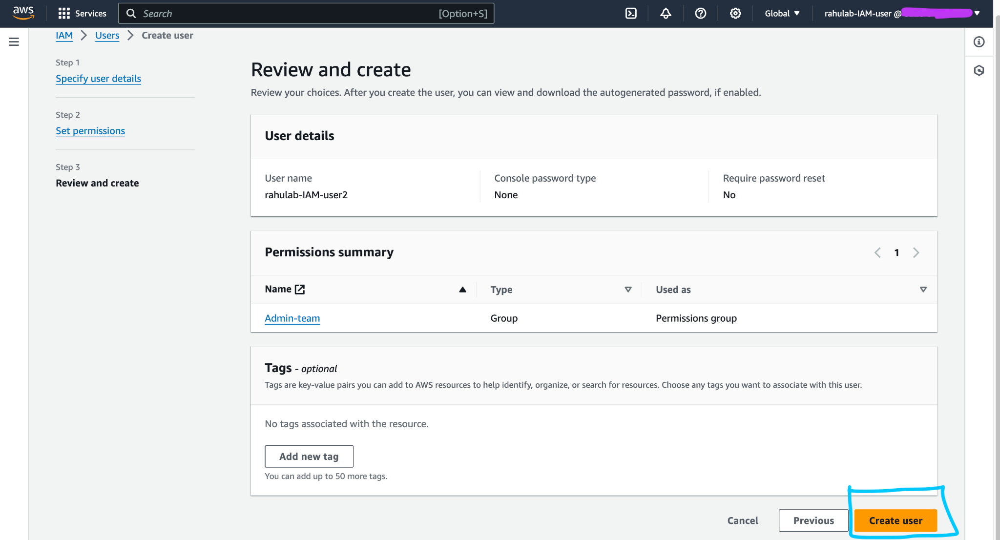

# ARTIS HPC

This repository contains the instructions to create the ARTIS High Performance Computer (HPC) on Amazon Web Services (AWS) and run the ARTIS model. There are two scenarios for using this repository:

1) Setting up a new ARTIS HPC on AWS
    - Likely able to follow instructions top to bottom
2) Running an Existing ARTIS HPC Setup
    - Likely able to skip to [Setup Local Python Environment](#setup-local-python-environment) and skip [Setting Up New ARTIS HPC on AWS](#setting-up-new-artis-hpc-on-aws) if the previous model run was executed from the same local machine.

*All commands will be run in the terminal/command line and indicated with a "$" before the command or contained within a code block*

## Table of Contents

-   [Technologies Used](#technologies-used)
-   [Assumptions](#assumptions)
-   [Installations](#installations)
    -   [Homebrew Installation](#homebrew-installation)
    -   [AWS CLI Installation](#aws-cli-installation)
    -   [Terraform CLI Installation](#terraform-cli-installation)
    -   [Python Installation](#python-installation)
-   [Setup Local Python Environment](#setup-local-python-environment)
-   [AWS CLI Setup](#aws-cli-setup)
-   [Update ARTIS Model Scripts and Model Inputs](#update-artis-model-scripts-and-model-inputs)
-   [Setting Up New ARTIS HPC on AWS](#setting-up-new-artis-hpc-on-aws)
-   [Running Existing ARTIS HPC Setup](#running-existing-artis-hpc-setup)
-   [Combine ARTIS model outputs into CSVs](#combine-artis-model-outputs-into-csvs)
-   [Download Results, Clean Up AWS and Docker Environments](#download-results-clean-up-aws-and-docker-environments)
-   [Checks & Troubleshooting](#checks-troubleshooting)
    -   [Status of jobs submitted to AWS batch](#status-of-jobs-submitted-to-aws-batch)
    -   [Troubleshoot failed jobs](#troubleshoot-failed-jobs)
    -   [Check CloudWatch logs for specific job](#check-cloudwatch-logs-for-specific-job)
    -   [Check for all expected outputs in S3 bucket](#check-for-all-expected-outputs-in-s3-bucket)
-   [Create AWS IAM user](#create-aws-iam-user)
-   [Docker container `artis-image` details](#docker-container-artis-image-details)

## Technologies Used 

-   `Terraform`
    -   Creates all the AWS infrastructure needed for the ARTIS HPC.
    -   Destroys all AWS infrastructure for the ARTIS HPC after the ARTIS model has finished to save on unnecessary costs.
-   `Docker`
    -   Creates a docker image that our HPC jobs will use to run the ARTIS model code.
-   `Python`
    -   Uses the Docker and AWS Python (boto3) clients to:
        -   Push all model inputs to AWS S3
        -   Build docker image needed to run ARTIS model
        -   Push docker image to AWS ECR
        -   Submit jobs to AWS Batch
        -   Download model outputs from AWS S3 bucket
-   `R`
    -   Main basis of the ARTIS model code
-   `AWS` (Amazon Web Services) 
    -   `IAM` (Identity and Access Management)
        -   Manages all AWS users and permissions
    -   `S3` (Simple Storage Service)
        -   Stores all model inputs and outputs outside of the docker container run in the VPC (Virtual Private Cloud)
    -   `VPC` (Virtual Private Cloud)
        -   Isolated section of the AWS cloud where all AWS resources are run. It is a virtual network dedicated to your AWS account.
    -   `ECR` (Elastic Container Registry)
        -   Stores the docker image `artis-image` that contains the environment, code, and inputs needed to run the ARTIS model
    -   `EC2` (Elastic Compute Cloud)
        -   cloud-based service that provides scalable virtual servers (referred to as instances) in the cloud. It runs ARTIS on a virtual machine.
    -   `Batch` (Batch Computing Service)
        -   Manages and schedules the execution of jobs. It handles the provisioning of the necessary compute resources (like EC2 instances), queues jobs, and dispatches them to the appropriate resources for execution.
    -   `CloudWatch`
        -   Monitors and logs all AWS resources. Logs are used to troubleshoot failed jobs.

    
**AWS Batch Based Architecture**

[Content from AWS Documentation](https://docs.aws.amazon.com/it_it/wellarchitected/latest/high-performance-computing-lens/batch-based-architecture.html)


Basic workflow steps:

1) User creates a job container (`artis-image`), uploads the container to the Amazon Elastic Container Registry, and creates a job definition to AWS Batch. 
2) User submits jobs to a job queue in AWS Batch. 
3) AWS Batch pulls the image from the container registry and processes the jobs in the queue 
4) Input and output data from each job is stored in an S3 bucket (`artis-s3-bucket`)

## Assumptions:

-   An AWS root user was created (To create an AWS root user visit [ ](aws.amazon.com))
-   AWS root user has created an admin user group with "AdministratorAccess" permissions.
-   AWS root user has created IAM users
-   AWS root user has add IAM users to admin group
-   AWS IAM users have their `AWS AWS_ACCESS_KEY` and `AWS_SECRET_ACCESS_KEY`

To create an AWS IAM user follow the instructions here: [Create AWS IAM user](#create-aws-iam-user)

**Note**: If have you created *ANY* AWS RESOURCES for ARTIS manually, not including ROOT and IAM users, please delete these before continuing.

## Installations

-   [Homebrew](#homebrew-installation)
-   [AWS CLI](#aws-cli-installation)
-   [Terraform CLI](#terraform-cli-installation)
-   [Python Installation](#python-installation)
    -   Python packages
        -   docker
        -   boto3

### Homebrew Installation

**Note**: If you already have Homebrew installed please still confirm by following step 3 below. Both instructions should run without an error message.

1.  Install homebrew - **run**$

``` sh
/bin/bash -c "$(curl -fsSL https://raw.githubusercontent.com/Homebrew/install/HEAD/install.sh)"
```

2.  **Close** existing terminal window where installation command was run and **open** a new terminal window
3.  Confirm homebrew has been installed -
    - **Run** $`brew --version`. No error message should appear.

*If after homebrew installation you get a message stating* `brew command not found`:

4.  Edit zsh config file, **run** $`vim ~/.zshrc`

5.  **Type** `i` to enter edit mode
6.  **Copy & paste** this line into the file you opened:

``` sh
export PATH=/opt/homebrew/bin:$PATH
```

7.  **Press** `Shift` and :
8.  **Type** `wq`
9.  **Press** `Enter`
10. Source new config file, **run** $`source ~/.zshrc`

### AWS CLI Installation

[Following instructions from AWS](https://docs.aws.amazon.com/cli/latest/userguide/getting-started-install.html)

**Note**: If you already have AWS CLI installed please still confirm by following step 3 below. Both instructions should run without an error message.

The following instructions are for MacOS users:

1.  **Run** $`curl "https://awscli.amazonaws.com/AWSCLIV2.pkg" -o "AWSCLIV2.pkg"`
2.  **Run** $`sudo installer -pkg AWSCLIV2.pkg -target /`
3.  Confirm AWS CLI has been installed:
    1.  **Run** $`which aws`
    2.  **Run** $`aws --version`

### Terraform CLI Installation

**Note**: If you already have homebrew installed please confirm by **running** $`brew --version`, no error message should occur.

To install terraform on MacOS we will be using homebrew. If you do not have homebrew installed on your computer please follow the installation instructions [here](https://brew.sh/), before continuing.

Based on Terraform CLI installation instructions provided [here](https://developer.hashicorp.com/terraform/tutorials/aws-get-started/install-cli).

1.  **Run** $`brew tap hashicorp/tap`
2.  **Run** $`brew install hashicorp/tap/terraform`
3.  **Run** $`brew update`
4.  **Run** $`brew upgrade hashicorp/tap/terraform`

If this has been unsuccessful you might need to install xcode command line tools, try:

5.  Run terminal command: `sudo xcode-select --install`

### Python Installation

- install python3 on MacOS: **Run** $`brew install python3`
- check python3 has been installed: **Run** $`python3 --version`
- install pip (package installer for python): **Run** $`sudo easy_install pip`

## Setup Local Python Environment

To prepare for running the ARTIS model on AWS we need to create a virtual environment to run the python scripts in. **Note**: Please make sure that your terminal is currently in the correct working directory for this project (should end in `.../.../artis-hpc`)

1.  **Run** $`pwd` to confirm you are in the correct working directory
1.  **Run** $`python3 -m venv venv` to create a virtual environment
2.  **Run** $`source venv/bin/activate` to open virtual environment
3.  **Run** $`pip3 install -r requirements.txt` to install all required python modules
4.  **Run** $`pip3 list` to check that all python modules have been downloaded. Check that all modules in the `requirements.txt` file are included.

If an error occurs please follow these instructions:

5.  Upgrade your version of pip,  **Run** $`pip install --upgrade pip`
6.  Install all required python modules, **Run** $`pip3 install -r requirements.txt`
7.  If errors still occur install each python package in the `requirements.txt` file individually, **Run** $`pip3 install [PACKAGE NAME]` ie $`pip3 install urllib3`.

## AWS CLI Setup

1.  **Run** $`export AWS_ACCESS_KEY=[YOUR_AWS_ACCESS_KEY]`
    -   sets terminal environmental variable. Replace `[YOUR_AWS_ACCESS_KEY]` with your value
2.  **Run** $`export AWS_SECRET_ACCESS_KEY=[YOUR_AWS_SECRET_ACCESS_KEY]`
    -   sets terminal environmental variable. Replace `[AWS_SECRET_ACCESS_KEY]` with your value
3.  **Run** $`export AWS_REGION=us-east-1`
    -   sets terminal environmental variable
4.  **Run** $`aws configure set aws_access_key_id $AWS_ACCESS_KEY`
    -   writes value to AWS credentials file (`~/.aws/credentials`)
5.  **Run** $`aws configure set aws_secret_access_key $AWS_SECRET_ACCESS_KEY`
    -   writes value to AWS credentials file (`~/.aws/credentials`)
6.  **Run** $`aws configure set region $AWS_REGION`
    -   writes value to AWS config file (`~/.aws/config`)

To check set values:

**Run** $`echo $AWS_ACCESS_KEY` to display the local environmental variable value set with the `export` command. Replace the variable name to check other values

Likewise, **Run** $`aws configure get aws_access_key_id` to print aws environment variable values stored in the AWS credentials file. Replace the variable name to check other values. 

## Update ARTIS model scripts and model inputs 

You will need to transfer ARTIS code and input data (likely from [Seafood-Globalization-Lab/artis-model](https://github.com/Seafood-Globalization-Lab/artis-model) repo) to your local `artis-hpc` project directory:

1.  **Copy** `00-aws-hpc-setup.R`, `02-artis-pipeline.R`, and `03-combine-tables.R` scripts to `artis-hpc/data_s3_upload/ARTIS_model_code/`
2.  **Run** $`export HS_VERSIONS="[HS VERSIONS YOU ARE RUNNING, NO SPACES]"` to specify which HS versions to run
    - i.e. $`export HS_VERSIONS="02,07,12,17,96"` or $`export HS_VERSIONS="17"` 
3.  **Run** $`./create_pipeline_versions.sh` to create a new version of `02-artis-pipeline.R` and `00-aws-hpc-setup.R` for every HS version specified to run in `HS_VERSIONS` in `artis-hpc/data_s3_upload/ARTIS_model_code/`
4.  **Copy** the most up-to-date set of `model_inputs` to `artis-hpc/data_s3_upload/` directory. Retain the folder name `model_inputs`
5.  **Copy** the most up-to-date ARTIS `R/` package folder to `artis-hpc/data_s3_upload/ARTIS_model_code/`
6.  **Copy** the most up-to-date ARTIS R package `NAMESPACE` file to `artis-hpc/data_s3_upload/ARTIS_model_code/`
7.  **Copy** the most up-to-date ARTIS R package `DESCRIPTION` file to `artis-hpc/data_s3_upload/ARTIS_model_code/`
8.  **Copy** the most up-to-date .Renviron file to `artis-hpc/data_s3_upload/ARTIS_model_code/` (-AM is this needed?)

*If running on a new Apple chip arm64*:

9.  **Copy** `arm64_venv_requirements.txt` file from the root directory to the `artis-hpc/docker_image_files_original/`
10.  **Rename** the file `artis-hpc/docker_image_files_original/arm64_venv_requirements.txt` to `artis-hpc/docker_image_files_original/requirements.txt`


## Setting Up New ARTIS HPC on AWS 

The `initial_setup.py` script automates the setup process for running the ARTIS model on AWS. It begins by configuring the environment based on the specified chip architecture, copying the appropriate `Dockerfile` to the project root, and embedding AWS credentials. The script then creates the necessary AWS infrastructure using Terraform, uploads model input files to the specified S3 bucket, and builds a Docker image using files from the `docker_image_files_original/` directory. This image is uploaded to the AWS ECR repository. Finally, the script submits jobs to AWS Batch for model execution. In case of an error, the script automatically cleans up all created AWS resources. 

*Anytime there are edits or changes to the ARTIS model codebase there is no need to recreate the docker image, skip to [Running an Existing ARTIS HPC Setup](#running-an-existing-artis-hpc-setup)*

1.  **Open** Docker Desktop
2.  **Take note** of any existing docker images and containers relating to other projects and
    -  **Delete** all docker containers relating to ARTIS,
    -  **Delete** all docker images relating to ARTIS.
4.  Create AWS infrastructure, upload model inputs, and create new ARTIS docker image, **Run**:

``` sh
python3 initial_setup.py -chip [YOUR CHIP INFRASTRUCTURE] -aws_access_key [YOUR AWS KEY] -aws_secret_key [YOUR AWS SECRET KEY] -s3 artis-s3-bucket -ecr artis-image
```

**Details**:

  - If you are using an Apple Silicone chip (M1, M2, M3, etc) your chip will be `arm64`, otherwise for intel chips it will be `x86`
  - If you have an existing docker image you would like to use include the `-di [existing docker image name]` flag.
  - **Recommendation**: the default options will create a docker image called `artis-image`, so if you want to use the previously created default docker image you would include `-di artis-image`.
  - **Note:** The AWS docker image repository and the docker image created with default options both have the name `artis-image`, however they are two different resources.

**Example command**: 

  - Using credentials stored in local environmental variables set above
  - Using existing docker image `artis-image` with the `latest` tag)

``` sh
python3 initial_setup.py -chip arm64 -aws_access_key $AWS_ACCESS_KEY -aws_secret_key $AWS_SECRET_ACCESS_KEY -s3 artis-s3-bucket -ecr artis-image -di artis-image:latest
```

**Troubleshooting Tip:** If terraform states that it created all resources however when you log into the AWS console to confirm cannot see them, they have most likely been created as part of another account. Run `terraform destroy -auto-approve` on the command line. Confirmed you have followed the AWS CLI set up instructions with the correct set of keys (AWS access key and AWS secret access key).

*A successful and complete model run will then proceed to the next step [Combine ARTIS model outputs into CSVs](#combine-artis-model-outputs-into-csvs)*

## Running Existing ARTIS HPC Setup 

**Note:** These instructions are only applicable if:

  - all AWS infrastructure is created
  - docker image `artis-image` is built and 
  - the only changes are to files within `model_inputs/*` or `ARTIS_model_code/*`. 

1.  **Log onto AWS** to check s3 bucket `artis-s3-bucket` for contents that need to be saved. Then **permanently delete** *all contents* of the `artis-s3-bucket` bucket.
2.  Make sure to put all new scripts or model inputs into the relevant `artis-hpc/data_s3_upload/` folders locally.
3. **Run**: $`source venv/bin/activate` to open python environment (make sure proper requirements were installed [here](#setup-local-python-environment)) 
3.  **Run**: $`python3 s3_upload.py` to upload local contents of `data_s3_upload/` to AWS S3 bucket `artis-s3-bucket`
4.  **Run**: $`python3 submit_artis_jobs.py` to submit batch jobs on AWS. 
    - Loops through designated `HS_VERSIONS` to run corresponding shell scripts to source `docker_image_artis_pkg_download.R` and `02-artis-pipeline_[hs version].R`
    
*A successful and complete model run will then proceed to the next step [Combine ARTIS model outputs into CSVs](#combine-artis-model-outputs-into-csvs)*

## Combine ARTIS model outputs into CSVs 

-    **Run** $`python3 submit_combine_tables_job.py`

## Download results, Clean up AWS and Docker environments 

1.  **Run** $`python3 s3_download.py` to download `artis-s3-bucket` contents to local `artis-hpc/outputs_[RUN YYYY-MM-DD]` directory

3.  **Open** Docker Desktop app,
      4.  **Delete** all containers created
      5. **Optional** to delete ARTIS images - can retain if planing to run the model again

6.  **Run** $`terraform destroy` to destroy all AWS resources and dependencies created
      - This is important to not be charged money for maintaining idle resources and storing GBs of data in S3 buckets
7.  **Run** $`deactivate` to close python environment


## Checks & Troubleshooting 

### Status of jobs submitted to AWS batch:

1.   navigate to AWS in your browser and log in to your IAM account.
2.   Use the search bar at the top of the page to search for "batch" and click on the service Batch result.


3.   Under "job queue overview" you will be able to see job statuses and click on number to open details. 


  
4.   Investigate individual job status and details through filters (be sure to click "search")


### Troubleshoot failed jobs:

1.   Set "Filter type" to "Status" and "Filter value" to "FAILED" in AWS Batch > Jobs window above. Click "Search" button.
2.   Identify and open relevant failed job by clicking on job name. 
3.   Inspect "Details" for Failed job, "Status Reason" is particularly helpful.
4.   Click on "Log stream name" to open CloudWatch logs for the specific job. This displays the code output and error messages.
    - **Note:** The "AWS Batch > Jobs > your-job-name" image below shows a common error message `ResourceInitializationError: unable to pull secrets or registry auth: [...]` when there is an issue initializing the resources required by the AWS Batch job. This is most likely a temporary network issue and can be resolved by re-running the specific job (HS version).


**Note:** The image above shows a common error message when the model code is unable to find the correct file path.

### Check CloudWatch logs for specific job:

1.   Search for "cloudwatch" in search bar and click on the Service CloudWatch
2.   In the left hand nav-bar click on "Logs"" then "Log groups" and next "/aws/batch/job"
3.   Inspect "log streams" for (likely by "last event time") to identify and open correct log. 
4.   Inspect messages, output, and errors from running the model code

### Check for all expected outputs in S3 bucket:

1.   Navigate to the `artis-s3-bucket` in AWS S3. 
2.   Confirm that all expected outputs are present for submitting ARTIS model jobs.
    - The `outputs` folder should contain a `snet/` subfolder that has each HS version specified in the `HS_VERSIONS` variable
    - Each HS version folder should contain the applicable years 
    
*The expected directory structure is as follows:*

```sh
aws/artis-s3-bucket/
└── outputs/
    ├── cvxopt_snet/
    │   ├── HS[VERSION]/
    │   │   ├── [YEAR]/
    │   │   │   ├── [RUN YYYY-MM-DD]_all-country-est_[YEAR]_HS[VERSION].RDS
    │   │   │   ├── [RUN YYYY-MM-DD]_all-data-prior-to-solve-country_[YEAR]_HS[VERSION].RData # Might be only file for some year folders depending if all countries solved by quadprog
    │   │   │   ├── [RUN YYYY-MM-DD]_analysis-documentation_countries-with-no-solve-qp-solution_[YEAR]_HS[VERSION].txt
    │   │   │   ├── [RUN YYYY-MM-DD]_country-est_[COUNTRY ISO3C]_[YEAR]_HS[VERSION].RDS
    │   │   │   └── ...  
    │   │   └── [YEAR]/
    │   │       └── ...
    │   └── HS[VERSION]/
    │       └── ...
    ├── quadprog_snet/
    │   ├── HS[VERSION]/
    │   │   ├── [YEAR]/
    │   │   │   └── [RUN YYYY-MM-DD]_all-country-est_[YEAR]_HS[VERSION].RDS
    │   │   │   ├── [RUN YYYY-MM-DD]_all-data-prior-to-solve-country_[YEAR]_HS[VERSION].RData
    │   │   │   ├── [RUN YYYY-MM-DD]_analysis-documentation_countries-with-no-solve-qp-solution_[YEAR]_HS[VERSION].txt
    │   │   │   ├── [RUN YYYY-MM-DD]_country-est_[COUNTRY ISO3C]_[YEAR]_HS[VERSION].RDS
    │   │   │   └── ...
    │   │   ├── [YEAR]/
    │   │   │   └── ...
    │   │   └── no_solve_countries.csv # Key file to check   
    │   └── HS[VERSION]/
    │       └── ...
    ├── snet/
    │   ├── HS[VERSION]/
    │   │   └── [YEAR]/
    │   │       ├── [RUN YYYY-MM-DD]_S-net_raw_midpoint_[YEAR]_HS[VERSION].csv
    │   │       ├── [RUN YYYY-MM-DD]_all-country-est_[YEAR]_HS[VERSION].RDS
    │   │       ├── [RUN YYYY-MM-DD]_consumption_[YEAR]_HS[VERSION].csv
    │   │       ├── W_long_[YEAR]_HS[VERSION].csv
    │   │       ├── X_long.csv
    │   │       ├── first_dom_exp_midpoint.csv
    │   │       ├── first_error_exp_midpoint.csv
    │   │       ├── first_foreign_exp_midpoint.csv
    │   │       ├── first_unresolved_foreign_exp_midpoint.csv
    │   │       ├── hs_clade_match.csv
    │   │       ├── reweight_W_long_[YEAR]_HS[VERSION].csv
    │   │       ├── reweight_X_long_[YEAR]_HS[VERSION].csv
    │   │       ├── second_dom_exp_midpoint.csv
    │   │       ├── second_error_exp_midpoint.csv
    │   │       ├── second_foreign_exp_midpoint.csv
    │   │       └── second_unresolved_foreign_exp_midpoint.csv
    │   ├── [YEAR]/
    │   │   └── ...
    │   ├── [YEAR]/
    │   │   └── ...
    │   ├── V1_long_HS[VERSION].csv
    │   └── V2_long_HS[VERSION].csv


```

After submitting `submit_combine_tables_job` to AWS batch, the `artis-s3-bucket` should contain the additional following files:

```sh
aws/artis-s3-bucket/
└── outputs/
    ├── cvxopt_snet/
    │   └── ...
    ├── quadprog_snet/
    │   └── ...
    ├── snet/
    │   └── ...
    └── artis_outputs/
        ├── consumption_midpoint_all_hs_all_years.csv 
        └── snet_midpoint_all_hs_all_years.csv
    
# "midpoint"" is estimate type and will change if different estimate type is used
```


## Create AWS IAM User

**FIXIT**: include screenshots for creating an IAM user with the correct admin permissions.

1. Create an AWS root user
2. Create an IAM user group


3. Create an IAM user





4. Sign in as IAM user

<p align="center">
  
</p>


5. Get IAM user access key


Save the access key and secret key in a secure location (*i.e.* password manager)


## Docker container `artis-image` details

Once the docker image `artis-image` has been uploaded to AWS ECR, the docker container `artis-image` will need to import all R scripts and model inputs from the `artis-s3-bucket` on AWS. Once $`python3 submit_artis_jobs.py` is run, a new job on AWS Batch will run ARTIS on a new instance of the docker container for each HS version specified within each job. Each docker instance will only import the scripts and model inputs for the HS version and years it is running from `artis-s3-bucket` (occurs when `docker_image_artis_pkg_download.R` is sourced in `job_shell_scripts/`).

Example directory structure within `artis-image`:

```sh

/home/ec2-user/artis/
│
├── clean_fao_prod.csv
├── clean_fao_taxa.csv
├── clean_sau_prod.csv
├── clean_sau_taxa.csv
├── clean_taxa combined.csv
├── code_max_resolved.csv
├── fao_annual_pop.csv
├── hs-hs-match_HS[VERSION].csv (one file per each HS version)
├── hs-taxa-CF_strict-match_HS[VERSION].csv 
├── hs-taxa-match_HS[VERSION].csv
├── standardized_baci_seafood_hs[VERSION]_y[YEAR]_including_value.csv (one file per HS version/year combination)
├── standardized_baci_seafood_hs[VERSION]_y[YEAR].csv (one file per HS version/year combination)
├── standardized_combined_prod.csv
├── standardized_fao_prod.csv
├── standardized_sau_taxa.csv
│
│(Files pulled from `ARTIS_model_code/` in `artis-s3-bucket`. Folder not retained)
├── 00-aws-hpc-setup_hs[VERSION].R
├── 02-artis-pipeline_hs[VERSION].R
├── 03-combine-tables.R
├── NAMESPACE
├── DESCRIPTION
└── R/
    ├── build_artis_data.R
    ├── calculate_consumption.R
    ├── categorize_hs_to_taxa.R
    ├── classify_prod_dat.R
    ├── clean_fb_slb_synonyms.R
    ├── clean_hs.R
    ├── collect_data.R
    ├── compile_cf.R
    ├── create_export_source_weights.R
    ├── create_reweight_W_long.R
    ├── create_reweight_X_long.R
    ├── create_snet.R
    └── (Add all files)

```
